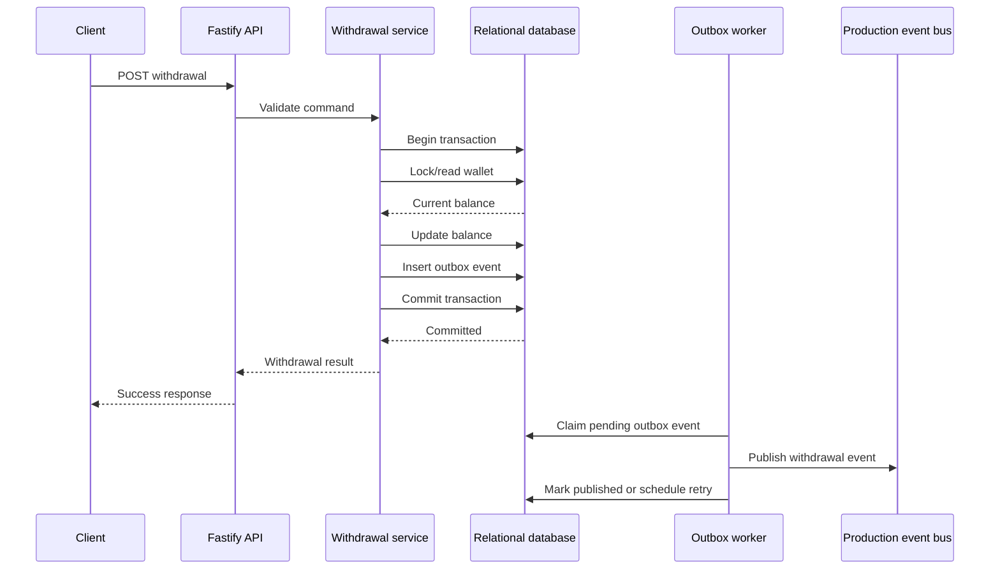
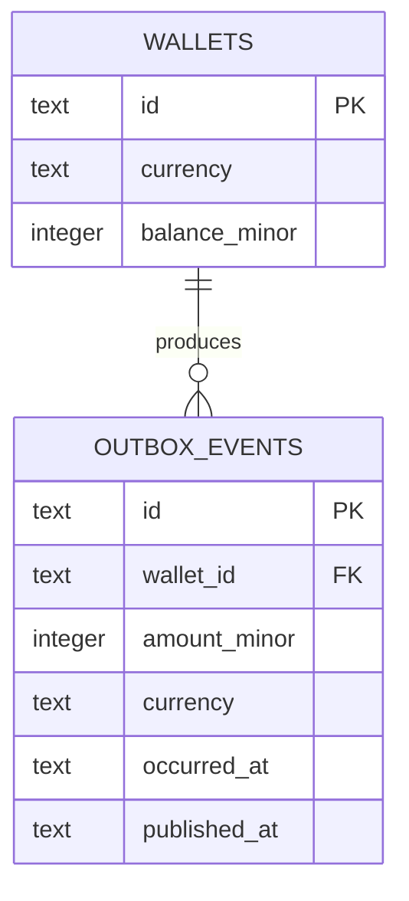

# Backend Architecture and Design Guide

## Design Goals

This is a small runnable assessment slice, not an attempt to implement a complete banking ledger.

Primary invariants:

1. A withdrawal amount is positive.
2. A withdrawal never makes the wallet balance negative.
3. A successful withdrawal changes the balance exactly once.
4. A successful withdrawal creates exactly one outbox event in the same transaction.
5. Failed withdrawals do not create withdrawal events.

## Layers

### Domain

Framework-independent rules for money, wallet state, and withdrawal decisions. Money uses integer minor units with a fixed ZAR currency assumption.

### Application

Use cases such as `GetBalance` and `WithdrawFunds`. This layer coordinates repositories and the transaction boundary through interfaces.

### Infrastructure

SQLite migrations, repositories, transaction handling, outbox persistence, and the background publisher. These adapters can later be replaced with PostgreSQL and an AWS event transport.

### HTTP

Fastify route registration, request validation, response mapping, and error-to-status translation. HTTP handlers do not contain accounting rules.

## Withdrawal Sequence



## Transaction and Concurrency

The production PostgreSQL implementation would lock the wallet row with `SELECT ... FOR UPDATE` before checking and changing the balance. This serializes competing withdrawals for the same wallet. A database check constraint also protects the non-negative balance invariant.

SQLite is used locally only to avoid external setup. Its locking model is documented as a local limitation; PostgreSQL is the production concurrency target.

## Transactional Outbox

The balance update and outbox insert must share one transaction. This prevents a committed balance change from being silently separated from its event record.

The publisher is at-least-once. A crash after publishing but before marking the outbox row published can produce a duplicate. Consumers therefore use the event ID as an idempotency key.

The local withdrawal event contains the event ID, wallet ID, amount in minor units, currency, and occurrence timestamp. Events remain pending when the configured sink fails and can be retried by the worker.

## Local Data Model



## AWS Production Mapping

```text
API service
  -> PostgreSQL on RDS/Aurora
       - wallet update
       - outbox insert
  -> outbox publisher
       -> EventBridge or SNS
            -> SQS queue per consumer
                 -> Lambda or ECS consumer
```

- **EventBridge:** managed event bus and routing rules for event types and AWS integrations.
- **SNS:** straightforward fan-out when multiple subscribers should receive the same event.
- **SQS:** durable consumer buffering, back-pressure, retries, visibility timeout, and dead-letter queues.

The assessment does not require all three locally. The outbox and worker test the consistency and failure contracts without requiring a cloud account or emulator.

## Future Production Improvements

- Idempotency keys on withdrawal requests.
- Immutable wallet transaction ledger and reconciliation.
- Authentication and authorization.
- PostgreSQL row locking and migration tooling.
- Structured logs, metrics, tracing, and alarms.
- Encryption, secrets management, and operational runbooks.
- Consumer deduplication and dead-letter remediation.
